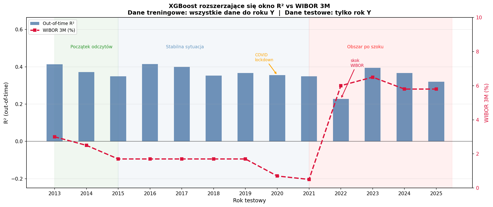
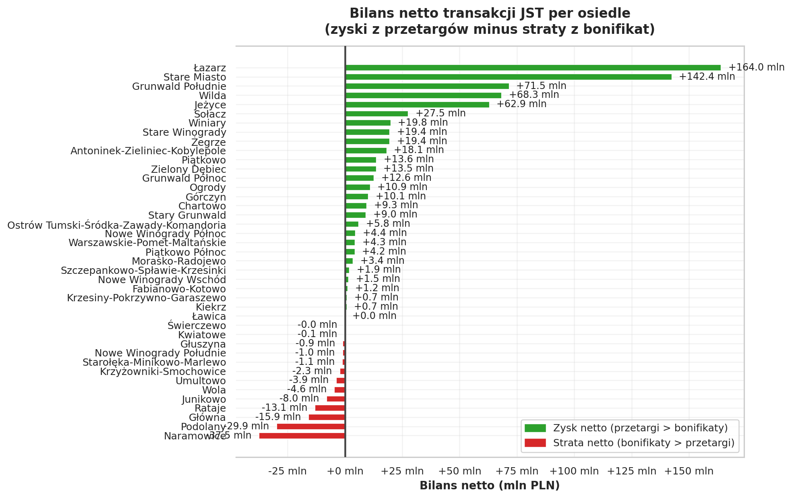
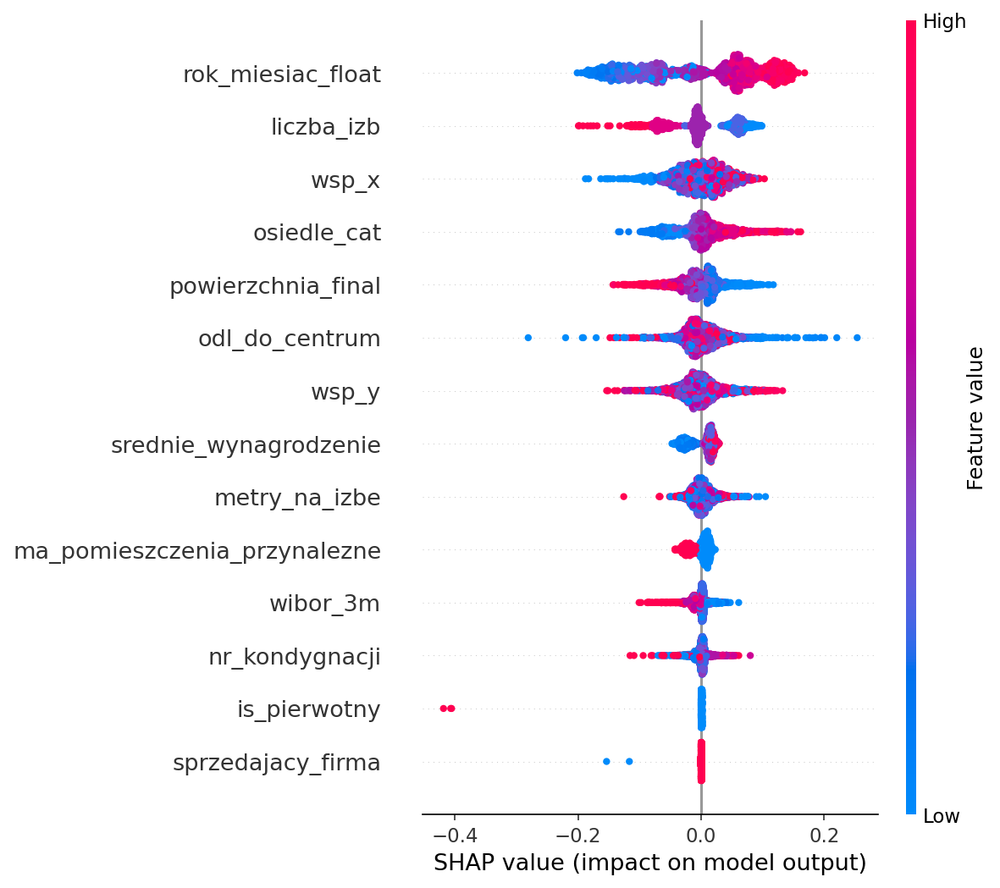
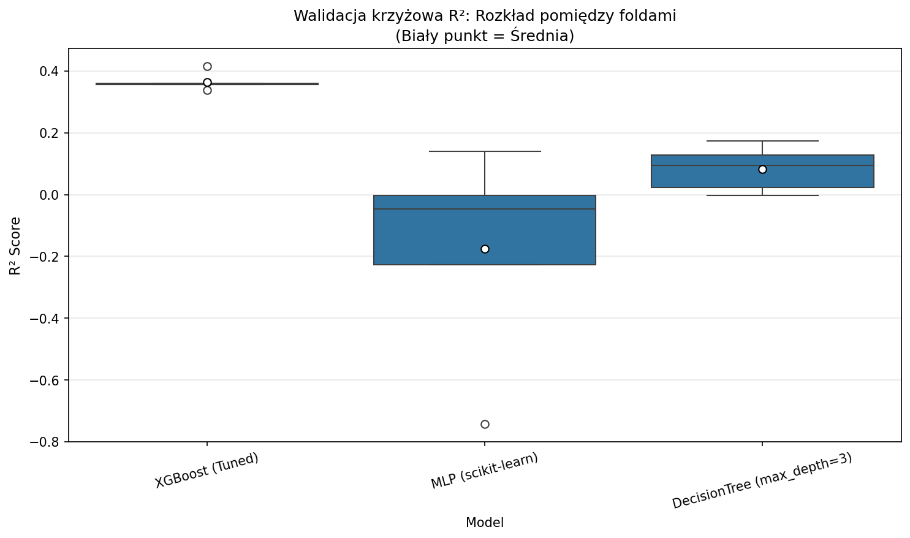
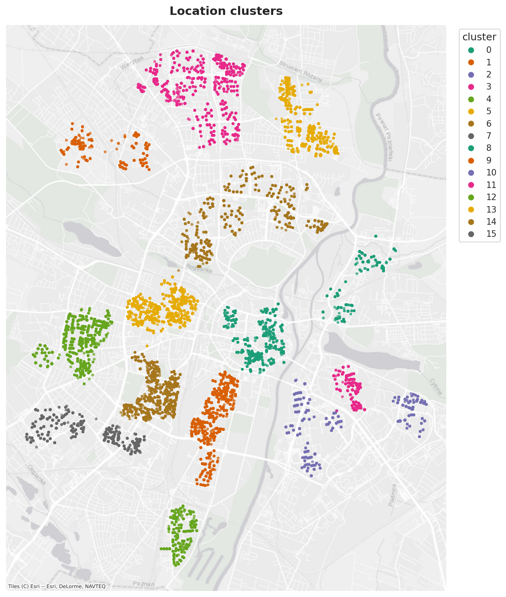

# Poznań Residential Real Estate: Hedonic Machine Learning, Macroeconomic Regime Shocks & Municipal Fiscal Analysis

[](https://www.python.org/downloads/release/python-3110/)
[](https://pytorch.org/)
[](https://xgboost.readthedocs.io/)
[](https://lightgbm.readthedocs.io/)
[](https://catboost.ai/)
[](https://geopandas.org/)
[](https://shap.readthedocs.io/)

A quantitative research and applied machine learning study investigating residential apartment price formation in Poznań, Poland (N = 38,154 transactions across 2013–2025). The project integrates cadastral transactional records from the **Rejestr Cen Nieruchomości (RCN)**, spatial density clustering, macroeconomic indicators (WIBOR, CPI, wage indices), and deep learning to model hedonic valuations under monetary regime shifts and evaluate municipal fiscal balances.

---

## Executive Summary & Core Research Findings

### 1. Macroeconomic Shock Breakdown (The 2022 WIBOR Shock)
A central econometric contribution of this project is quantifying how monetary policy tightening causes structural breakdown in micro-level hedonic pricing equations:
* **The Regime Shock:** Between late 2021 and 2023, the Polish Monetary Policy Council raised benchmark interest rates rapidly, driving WIBOR 3M from 0.2% to 6.9%.
* **Predictive Collapse:** In stable monetary conditions (2016–2020), the expanding-window out-of-time XGBoost model achieved steady predictive accuracy (R² = 0.266). Following the 2022 rate hike, the model's out-of-time accuracy dropped sharply to R² = 0.105–0.176, with real-space MAE increasing by over 40%.
* **Economic Implication:** Hedonic spatial-physical features (`powierzchnia_final`, `odl_do_centrum`) assume structural price equilibrium; when mortgage financing costs surge, buyer purchasing power contracts non-linearly, rendering static spatial valuations obsolete without macro-regime adjustments.



---

### 2. Municipal Fiscal Asymmetry (*Bilans Netto Transakcji JST*)
By benchmarking municipal transactions against district-level open-market valuations across time, we evaluate the net financial balance ($B_d$) of local government property sales:

$$B_d = \sum_{i \in d} \left(P_{i}^{\text{trans}} - P_{i}^{\text{market}}\right) \times \text{Area}_i$$

* **Aggregate Fiscal Deficit:** The municipal portfolio experienced a cumulative net financial deficit exceeding **21.2M PLN** relative to open-market benchmarks.
* **Dual-Regime Policy Mechanism:** 
  - **Tender Sales (*Przetargi*):** Competitive auctions for commercial and premium premises achieved sale prices above the local market median, generating revenue surpluses.
  - **Tenant Discounts (*Bonifikaty Komunalne*):** Over 95% of municipal transactions were statutory privatizations to long-term tenants, executed at discounts of 85% to 90% of appraised value.
* **Spatial Capital Redistribution:** Capital accumulated from commercial tender surpluses in central, high-value districts (Stare Miasto, Śródka) effectively served as an informal subsidy mechanism for social housing privatization across peripheral residential estates.



---

### 3. Dual-Model Feature Attribution (TreeSHAP vs. KernelSHAP)
Feature attribution reveals identical top-tier physical hierarchies across gradient-boosted trees and deep neural networks:
* **Primary Physical Drivers:** Proximity to the historical center (`odl_do_centrum`) and total usable area (`powierzchnia_final`) dominate prediction magnitude across both TreeSHAP (XGBoost) and KernelSHAP (PyTorch MLP).
* **Macroeconomic Anchors:** Temporal indices (`rok_miesiac_float`) and macroeconomic indicators (`wibor_3m`, `srednie_wynagrodzenie`) govern the baseline intercept shift over time.



---

## Model Benchmarking & Validation Protocol

To prevent temporal lookahead bias, all feature encoders, imputers, scalers, and hyperparameter tuners are evaluated strictly using **chronological `TimeSeriesSplit` cross-validation** and **expanding-window out-of-time evaluation** (training on all data prior to year $t$, testing on year $t$).

| Model Architecture | Valuation Target | Cross-Validation R² | Out-of-Time MAE (PLN/m²) | Out-of-Time MAPE | Key Characteristic |
| :--- | :--- | :---: | :---: | :---: | :--- |
| **Ridge Regression (L2)** | `log(cena_za_m2)` | 0.168 ± 0.038 | 1,612 | 19.4% | Linear regularized baseline |
| **ElasticNet (L1/L2)** | `log(cena_za_m2)` | 0.165 ± 0.040 | 1,624 | 19.6% | Sparse linear benchmark |
| **Random Forest** | `log(cena_za_m2)` | 0.231 ± 0.045 | 1,572 | 18.8% | Non-linear ensemble baseline |
| **LightGBM** | `log(cena_za_m2)` | 0.274 ± 0.041 | 1,555 | 18.5% | Fast gradient-boosted trees |
| **CatBoost** | `log(cena_za_m2)` | 0.279 ± 0.039 | 1,548 | 18.4% | Native categorical handling |
| **Tuned XGBoost** | `log(cena_za_m2)` | **0.286 ± 0.038** | **1,540** | **18.3%** | Top tree ensemble |
| **PyTorch Residual MLP** | `log(cena_za_m2)` | 0.213 ± 0.042 | **1,464** | **18.1%** | Deep learning with Huber loss |
| **Glass-Box Decision Tree** | `cena_za_m2` (Raw) | 0.142 ± 0.031 | 1,780 | 21.5% | Fully transparent heuristics (d=3) |



### Deep Learning Architecture (PyTorch Residual MLP)
The deep learning baseline is custom-built for tabular hedonic modeling:
* **Architecture:** Input layer $\to$ 3 Residual Blocks with LayerNorm, Dropout ($p = 0.2$), and LeakyReLU activations $\to$ Linear projection head.
* **Loss Function:** Huber Loss with $\delta = 1.0$, penalizing large price anomalies linearly while maintaining quadratic smoothness near zero.
* **Bias Initialization:** The output head bias is initialized to the training target mean ($\hat{y}_{\text{init}} = \bar{y}_{\text{train}}$), completely eliminating early saturation and accelerating convergence under AdamW with cosine annealing.

---

## Unsupervised Learning & Spatial Segmentation

In addition to supervised valuation, the repository implements three specialized unsupervised clustering engines:
1. **Spatial Density Clustering (HDBSCAN):** Identifies non-linear, high-density urban agglomerations from projected coordinates (`wsp_x`, `wsp_y`), isolating noise and peripheral outliers without imposing spherical cluster assumptions.
2. **Hedonic Property Segmentation (K-Means):** Partitions apartments into 4 distinct physical archetypes based on area, room layout, floor level, and central proximity, optimized via Elbow and Silhouette diagnostics.
3. **Macroeconomic Market Regimes (K-Means):** Clusters transactions into 3 distinct monetary eras: the pre-pandemic low-inflation baseline (2014–2019), the pandemic monetary stimulus era (2020–2021), and the post-2022 high-interest inflationary regime.



---

## Repository Architecture

```text
projekt/
├── README.md                                    <- Executive project overview and research findings
├── pyproject.toml                               <- Project dependencies, build system, and package metadata
├── docs/                                        <- Technical documentation, thesis report & notes
│   ├── report.tex                               <- Comprehensive academic report (LaTeX)
│   ├── project-summary.md
│   ├── repo-structure.md
│   └── methodology-notes.md
├── notebooks/                                   <- Sequential, presentation-ready Jupyter notebooks
│   ├── 01_data_loading_and_preprocessing.ipynb  <- Ingestion, domain filtering & sample export
│   ├── 02_exploration_and_feature_analysis.ipynb<- EDA, spatial basemaps & 3 clustering engines
│   ├── 03_modeling_and_validation.ipynb         <- Time-aware CV, PyTorch MLP, SHAP & macro backtest
│   └── 04_jst_analysis_and_summary.ipynb        <- Institutional municipal fiscal balance & KDE maps
├── src/                                         <- Production Python modules
│   ├── data_io.py                               <- Memory-efficient CSV/Parquet loading
│   ├── features.py                              <- Domain filtering, spatial & macroeconomic joins
│   ├── modeling.py                              <- TimeSeriesSplit CV, TreeSHAP & expanding window
│   ├── mlp.py                                   <- PyTorch Residual MLP, Huber loss & KernelSHAP
│   ├── clustering.py                            <- HDBSCAN spatial, property & temporal K-Means
│   ├── viz.py                                   <- Watermark-free Esri basemaps, diagnostics, styling
│   ├── metrics.py                               <- Econometric valuation metrics (MAE, MAPE, R2)
│   ├── reporting.py                             <- Formatted markdown summary tables
│   ├── config.py                                <- Path and environment resolution
│   └── config_styling.py                        <- Matplotlib and Seaborn styling configurations
├── scripts/
│   ├── jst_wizualizacje.py                      <- Municipal benchmark calculations & KDE maps
│   └── parse_rcn_gml.py                         <- XML/GML parser for raw cadastral registers
├── data/
│   ├── raw/                                     <- Raw transactional cadastral data
│   └── processed/                               <- Clean market (N = 38,154) & JST (N = 1,664) samples
└── plots/                                       <- 35 publication-ready charts (PNG)
```

---

## Quickstart & Execution

### 1. Environment Setup
```bash
# Clone the repository
git clone https://github.com/your-username/poznan-housing-market.git
cd poznan-housing-market

# Create and activate virtual environment
python3 -m venv .venv
source .venv/bin/activate

# Install dependencies in editable mode
pip install -e .
```

### 2. Running the Analytical Pipeline
The project is designed to be executed sequentially through the notebooks:

1. **`01_data_loading_and_preprocessing.ipynb`**
   - Applies the residential domain mask (`funkcja_lokalu == 1.0`, `udzial == 1.0`, open-market sale).
   - Clips 1st/99th target outliers, producing `housing_residential_market.csv` (38,154 rows) and `housing_jst_institutional.csv` (1,664 rows).

2. **`02_exploration_and_feature_analysis.ipynb`**
   - Renders missingness audits, log-variance transformations, price-distance gradients, and autocorrelation plots.
   - Executes spatial HDBSCAN and dual K-Means clusterers with watermark-free Esri WorldGrayCanvas basemaps.

3. **`03_modeling_and_validation.ipynb`**
   - Runs chronological `TimeSeriesSplit` cross-validation across all baseline models.
   - Evaluates the PyTorch Residual MLP and performs out-of-time yearly backtesting (2014–2025).
   - Generates the WIBOR shock overlay, residual diagnostics, TreeSHAP, and KernelSHAP attributions.

4. **`04_jst_analysis_and_summary.ipynb`**
   - Calculates the district-by-district municipal fiscal balance (*bilans netto*).
   - Generates KDE financial flow maps and audits extreme tenant discount subsidies.

---

## Methodological Rigor & Technical Competencies

* **Zero Lookahead Leakage:** Categorical target encoding and standard scalers are fitted strictly inside each training fold during cross-validation.
* **Log-Space Optimization with Real-Space Reporting:** Models optimize `log(1 + p)` to stabilize right-skewed error variance, while all evaluation metrics (MAE, MAPE) are reported in real Polish Złoty per square meter (PLN/m²) via `expm1`.
* **Watermark-Free Spatial Visualization:** Contextily spatial maps utilize `Esri.WorldGrayCanvas` and `Esri.WorldStreetMap` tiles (eliminating CARTO API key watermarks) with automatic bounding-box scaling and graceful offline fallback rendering.
* **Econometric & Policy Translation:** Demonstrates the ability to bridge complex machine learning models with institutional public policy questions, quantifying real-world fiscal transfers.
